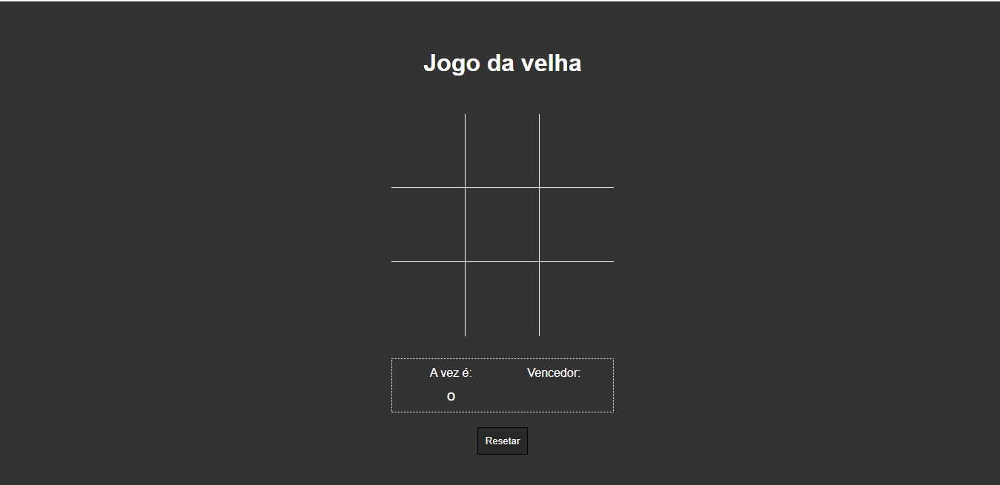
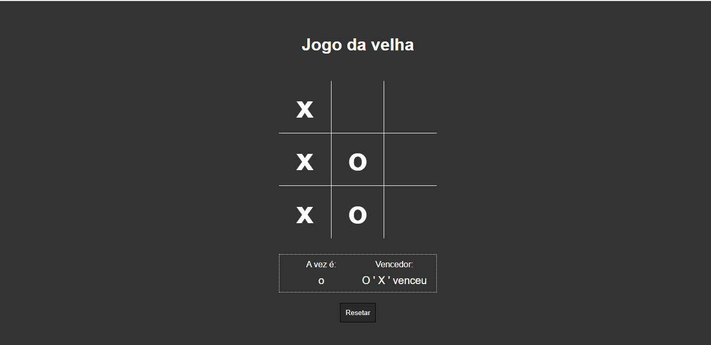
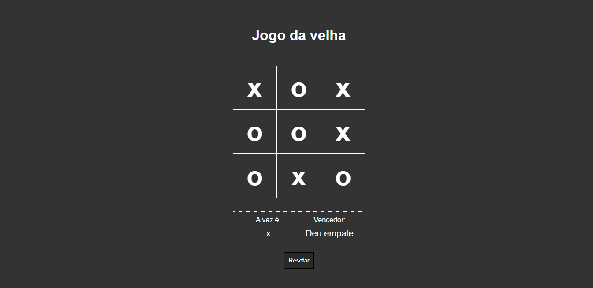

# 💻  Sobre o Projeto:
Este é um desafio desenvolvido durante o módulo de Java script do curso oferecido pela B7web, com o objetivo de evoluir a construção individual do aluno. Foi desenvolvido o famoso jogo da velha,foram utilizadas apena as tecnologia HTML5,CSS3 e Java Script.
 
# 🛠 Tecnologias utilizadas:

    <ul>
        <li>HTML</li>
        <li>CSS</li>
        <li>JavaScript</li>
    </ul>

# ⚙️ Funcionalidades:
<li>Na primeira seção da página, os usuários serão apresentados ao jogo da velha sendo escolhido aleatorimente o símbolo X ou O,que irá começar a partida.</li>
<li>Após clicar em qual campo o usuário gostaria de marcar,automaticamente será trocado a vez do símbolo.</li>
<li>Além de que, e mostrado quem foi o vencedor do jogo impossibilitando mais jogadas, e se o jogo empatar irá ocorrer o mesmo, alem disso, há um botão de resetar para ir ao início do jogo.</li>

# 🎨 Pré-visualização :
## Apresentação do Jogo

## Vencedor do jogo:

## Empate:

# 🦸 Autor:

 
<a href="https://www.linkedin.com/in/jo%C3%A3o-vitor-ribeiro-dias-339a56258/" target="_blank">João Vitor RIbeiro Dias</a>
